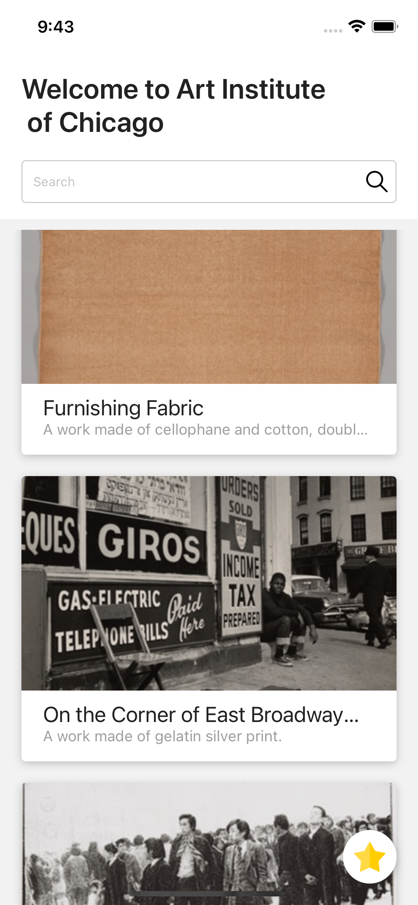
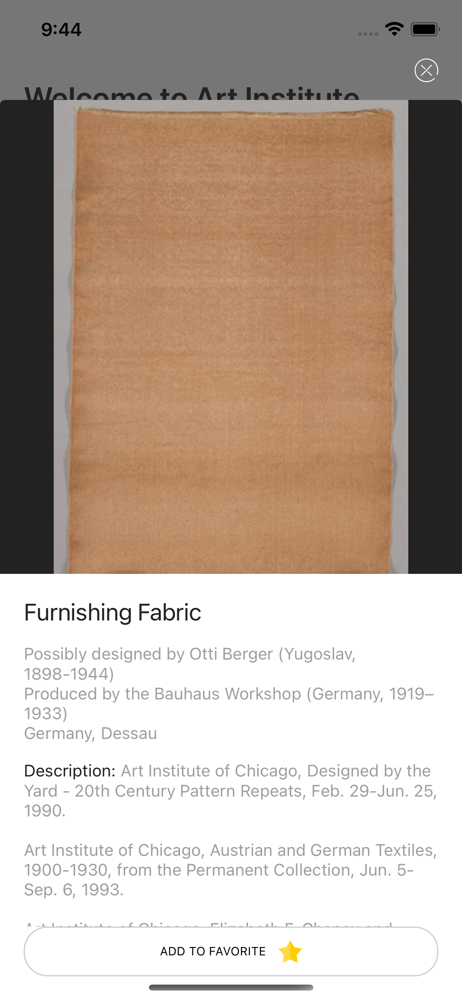
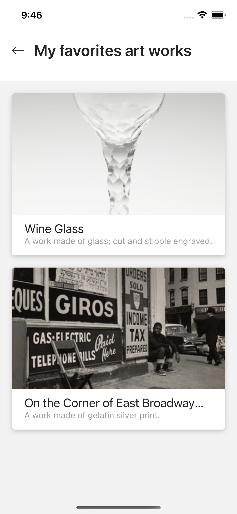

# Art Institute of Chicago

## Requirements: 

- Please install node v14.18.1
- Please install yarn v1.22.17
- Please install pod v1.11.3

## To run the project
Install node modules
```
yarn install
```
Install pods
```
npx pod-install
```
Start the metro bundle
```
yarn start
```
Run on ios
```
yarn ios
```

### Note: 

The project only was tested on ios, android version doesn't work. Some library configurations are missing.

<strong>Home Screen</strong>


<strong>Detail Screen</strong>


<strong>Favorite Screen</strong>

